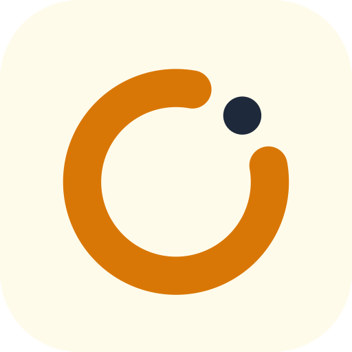
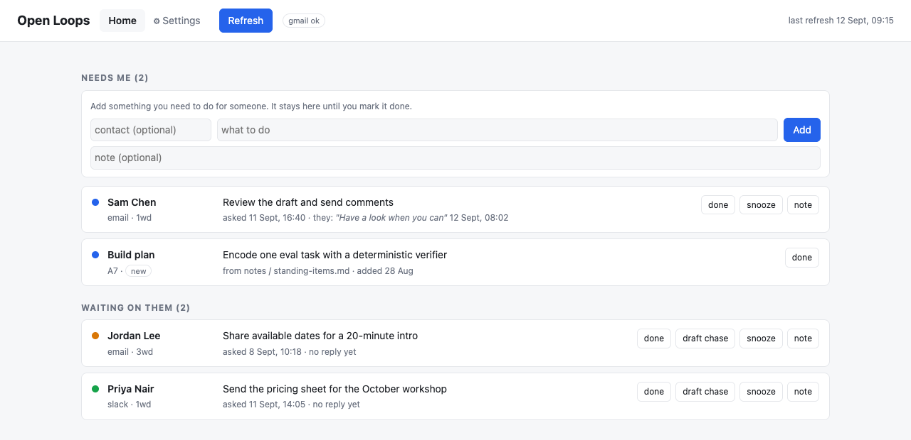

# Open Loops

The list of things you asked people for — and the things they are waiting on you for — on your computer, in your words.

Runs locally. Uses the Claude or Grok subscription you already have. No API key costs.

## Why you want this

You ask people for things all day, on Slack and by email. Most come back. The ones that do not just go
quiet, and a quiet thread gives you nothing to notice: no unread badge, no reminder, no reason to scroll
back. It happens in reverse too. Someone replied three days ago, you meant to answer that afternoon, and
the thread has since sunk below the fold.

Search does not fix it, because search only helps once you already remember the thing you have forgotten.
So the loop closes when the other person chases you, or it never closes at all.

Open Loops gives you one list to read in the morning: what you are owed, what you owe, and how long each
has been sitting there. Chasing stops being something you have to remember and becomes something you tick
off.

**Who it's for:** people who run work over Slack and email, and who are the hold-up in more threads than
they can keep in their head. Connect either source, or both. Each works on its own.

## What it does

- **Two lists, so you always know where you stand.** *Needs me* is the people who have replied and are now
  waiting on you. *Waiting on them* is your asks that are still outstanding, coloured green under two
  workdays, amber at two to four, red beyond that.
- **Writes the chase so you don't have to.** *draft chase* puts a "just checking in…" nudge into the
  original Slack DM or email thread as a **draft** you read and send. It learns your voice from how you
  already write to those people and pitches it by seniority, so the nudge to your boss does not read like
  the one to your mate. It never counts the times of asking: escalation is dates and what is blocked, not
  guilt.
- **Keeps your own to-dos in the same place.** Add a note with or without a contact, so the jobs only you
  can do sit next to the real threads instead of in a separate app you stop opening.
- **Reads a `standing-items.md` notes file, if you keep one**, so open items you wrote down in your notes
  show up on the same morning list. Marking one done asks how you closed it and writes that back to the
  file.
- **Closes loops properly.** *done* and *snooze* are local. A loop you have closed is still watched for
  five days and reopens if the person comes back with a new question, so nothing slips out the back.
- **Ready before you sit down.** It refreshes itself every weekday morning, by default at 09:15.
- **Optional timer**, off unless you switch it on: chases anything quiet for N workdays automatically, with
  a cap per loop and an *auto: on/off* switch on every card.

Setting up takes one pass through Settings. On first run it suggests the dozen or so people you message
most, guesses *senior / peer / junior / external* for each, and asks you to correct it. *Learn my tone*
then reads how you actually write to them, which is what makes the drafts sound like you rather than like
a reminder bot.

## Why it's safe to trust

- **It runs on your machine.** A small local web page, no servers. Your list stays in `state.json` there,
  and tokens and settings are gitignored.
- **It reads your own sent messages and the threads they sit in. Nothing else.** Other people's messages
  are read only to check for a reply on a loop you already have.
- **Drafts by default.** It sends only if you tick *Send to internal* / *Send to external*. The send tools
  are handed to the AI run only when those boxes are ticked, so with both off it cannot send.
- **No API key costs and no new accounts.** It drives the Claude or Grok CLI you are already signed in to.
- **Every run leaves a log** in `state/logs/`, so you can see what it looked at and what it decided.
- **Open source, MIT licence.** Read it before you point it at your inbox.

## Install (1–3 minutes)

1. **Windows:** double-click `Open Loops.cmd`. **Mac:** double-click `Open Loops.command` (if macOS blocks it, right-click → Open).
2. Tick the checklist: sign in, connect Slack and/or Gmail (one is enough).
3. Open **Open Loops** from the Desktop each morning (Mac: orange-loop app — drag it to the Dock).

Guides: [GETTING-STARTED.md](GETTING-STARTED.md) · [INSTALL.md](INSTALL.md) (Grok Gmail step is here).
What is planned next: [ROADMAP.md](ROADMAP.md).

MIT licence. WhatsApp is not possible (no API for personal accounts).
